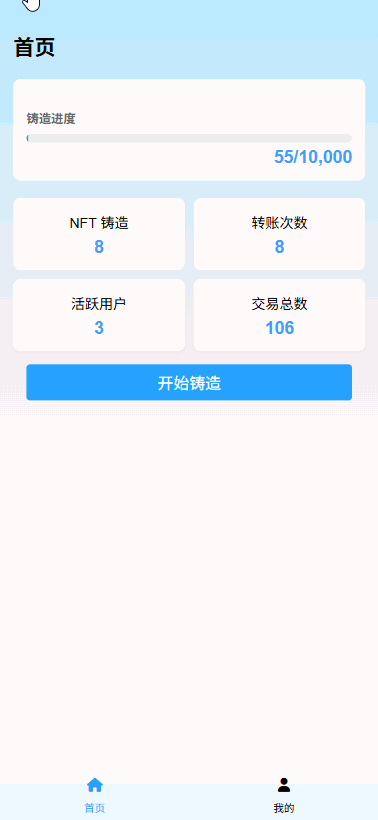

## 事件驱动架构（EDA）
伴随系统业务的快速拓展，几百个分布式微服的落地，CPU密集或IO密集所带来的影响也随之到来，监控系统以及预警规则的告警总会在某个时刻充斥工作群，在传统的系统架构中为了应对这种突发流量和突发计算通常会使用水平拓展硬件的方式（即HPA），但随着上百个微服的落地，这种方法不仅效果不显著而且不可控。于是分解IO/CPU密集的服务，平缓计算能力，高效率使用ECS的系统架构显得尤其重要。

- **服务解耦**：服务通过事件通信，减少直接依赖，提高可维护性。  
- **异步处理**：将瞬时请求转为事件流，实现负载平滑分布，缓解高峰压力。  
- **容错与弹性**：事件可持久化、重试、回溯，使系统具备内生容错能力。  
- **负载平滑**：事件流天然将负载分散，使计算资源充分利用。  
- **事件溯源**：记录完整业务变化轨迹，为调试、审计、分析提供便利。  

### 案列演示

- [订单状态流转](#订单状态流转)  
- [上传文件处理](#上传文件处理)  
- [区块链链上链下整合](#区块链链上链下整合)

### 微服务整合实践

- **事件总线**：服务间通过事件流通信，减少同步阻塞调用，提高系统弹性。  
- **可靠投递**：消息队列保证事件可靠传递，支持顺序保证和重试机制。  
- **读写分离优化**：CQRS 将写操作和读操作拆分，提升性能和扩展性。  
- **水平扩展能力**：事件流可自然扩展系统容量，无需暴力扩容。  
- **内生容错**：异步事件处理提供重试、回溯和补偿机制，提高系统可用性。  

### web3整合实践

- **链上事件捕获**
  - 通过智能合约事件（Event）监听链上状态变化，如 ERC721 NFT Mint 等。
- **异步事件处理**
  - 事件写入消息队列（Kafka / Redis Stream），通过 CQRS 分离写操作与读操作。
- **事件驱动查询侧**
  - 读服务订阅事件流，更新缓存或视图数据库，为前端提供高性能查询。
- **前端实时更新**
  - 通过 SSE、WebSocket 或 GraphQL Subscription，前端实时获得链上状态更新。
- **跨链/多服务整合**
  - 不同链或微服务产生的事件统一通过事件总线处理，保持数据一致性和可追溯性。
- **容错与回溯**
  - 事件流支持重试、延迟处理和历史回溯，保证系统在链上事件异常时仍可恢复数据状态。
- **安全性与验证**
  - 链上事件可通过 Merkle Proof、签名验证等机制保证真实性，确保前端展示的数据可信。

#### 订单状态流转

#### 上传文件处理

#### 区块链链上链下整合

